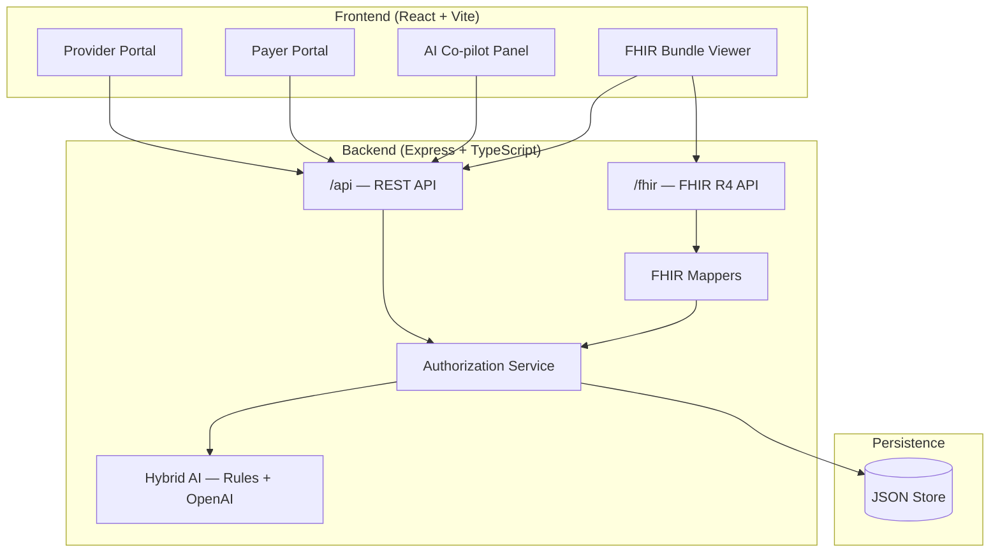

# Healthcare Connector Platform

A smart **healthcare connector** for **prior authorization** workflows. Providers and payers exchange authorization requests and responses through a bidirectional platform powered by **FHIR R4** standards and an **AI co-pilot** that validates data before submission and assists payer review.


---

## Problem Statement

The healthcare industry lacks seamless **bidirectional communication** between providers and payers for authorization workflows. Existing systems often support one-way communication, leading to:

- Incomplete authorization requests
- Excessive back-and-forth between parties
- Delayed care and manual rework

**This platform solves that** by enabling providers to submit validated prior auth requests and payers to respond with structured FHIR adjudication — with full tracking and notifications on both sides.

---

## Features

### Provider Module
- Create **prior authorization requests** with patient, diagnosis (ICD-10), procedure (CPT), and service details
- **AI Co-pilot** validates in real time as you type (quality score, issues, recommendations)
- Submit requests to selected payers
- Track status, view payer responses, edit and resubmit when revision is requested
- View **FHIR R4 resource bundle** for each request

### Payer Module
- Review incoming authorization queue (prioritized by status)
- **AI Review Assistant** with auto-corrections, risk flags, and suggested actions
- Approve, deny, or request revision with notes
- Generates structured **FHIR ClaimResponse** on every adjudication action

### AI Co-pilot (Hybrid: Rules + LLM)

The co-pilot uses a **production hybrid architecture**:

| Layer | Role |
|-------|------|
| **Rules engine** | Deterministic validation — required fields, ICD-10/CPT patterns, format checks, code suggestions. **Always gates submit** (auditable, no API cost). |
| **LLM layer** (OpenAI) | Enriches with clinical insights, coding notes, medical necessity analysis, and additional risk flags when `OPENAI_API_KEY` is configured. |

Without an API key the app runs in **rules-only** mode — fully functional for demos. With a key it runs in **hybrid** mode (`engine: "hybrid"` in API responses).

| Side | Capabilities |
|------|--------------|
| **Provider** | Required field checks, ICD-10/CPT validation, code suggestions, quality score (0–100), **Apply** for recommendations, **LLM Clinical Insight** panel, blocks submit until rules pass |
| **Payer** | Auto-correction, risk flagging, suggested action, confidence score, **Medical Necessity (LLM)** analysis |

#### Enable LLM (optional)

```bash
cp server/.env.example server/.env
# Edit server/.env — add your OPENAI_API_KEY
```

| Variable | Default | Description |
|----------|---------|-------------|
| `OPENAI_API_KEY` | — | OpenAI API key (required for hybrid mode) |
| `OPENAI_MODEL` | `gpt-4o-mini` | Chat model for structured JSON responses |
| `OPENAI_TIMEOUT_MS` | `15000` | Request timeout |
| `AI_LLM_ENABLED` | `true` | Set `false` to disable LLM even with a key |

Restart the server after changing `.env`. Check mode:

```bash
curl http://localhost:3001/api/ai/status
# With key:    {"llmConfigured":true,"mode":"hybrid","model":"gpt-4o-mini"}
# Without key: {"llmConfigured":false,"mode":"rules_only"}
```

The UI shows **Hybrid AI · gpt-4o-mini** in the co-pilot header when LLM is active. See [Restart the project](#restart-the-project) if you change the key.

#### Provider co-pilot (New Auth Request form)

- Appears on the **right panel** while filling the form
- Updates automatically ~500ms after you type
- Shows **Quality Score** (0–100), **Issues** (errors/warnings), and **Recommendations**
- Example: typing diagnosis *"patient has diabetes"* without an ICD code → suggests **E11.9**
- Example: typing *"office visit"* without CPT → suggests **99213**
- **Submit is blocked** if there are errors or score is below 60

#### Payer AI Review Assistant (Auth Queue → open a request)

- Shows when a payer opens a submitted request
- **Auto-corrections**: e.g. `e11.9` → `E11.9`, `john smith` → `John Smith`
- **Risk flags**: e.g. high claim amount triggers senior review warning
- **Suggested action**: approve, reject, request revision, or review manually
- On **Approve**, auto-corrections can be applied to the record

#### Verify the co-pilot works (30 seconds)

1. Log in as `provider@cityhospital.com` → **New Auth Request**
2. Enter diagnosis description **"Type 2 diabetes"** (leave ICD code empty)
3. Watch the co-pilot suggest **E11.9** → click **Apply**
4. Log in as `payer@healthguard.com` → open a request → see **AI Review Assistant**

#### API endpoints (for testing)

```bash
# Provider validation
curl -X POST http://localhost:3001/api/ai/validate \
  -H "Content-Type: application/json" \
  -d '{"patient_name":"Jane Doe","diagnosis_description":"Type 2 diabetes","procedure_description":"office visit"}'

# Payer review
curl -X POST http://localhost:3001/api/ai/review \
  -H "Content-Type: application/json" \
  -d '{"patient_name":"john smith","diagnosis_code":"e11.9","claim_amount":150000}'
```

**Interview note:** Explain the hybrid design: *"Rules gate submission for compliance and auditability; the LLM adds clinical context and medical necessity analysis without replacing deterministic checks."*

### Tracking & Notifications
- Status workflow with activity timeline on every request
- Dashboards with stats, charts, and recent requests
- Real-time notification bell with unread badge and click-through to requests

### FHIR R4 Integration
- Maps internal data to **Patient**, **Coverage**, **Claim** (`use: preauthorization`), and **ClaimResponse**
- RESTful FHIR endpoints for external system integration
- Authorization numbers (`preAuthRef`) generated on approval

---

## Architecture



---

## Tech Stack

| Layer | Technology |
|-------|------------|
| Frontend | React 18, TypeScript, Vite, Tailwind CSS, React Router |
| Backend | Node.js, Express, TypeScript |
| Data | JSON file store (demo-friendly, no DB setup required) |
| Standards | FHIR R4, ICD-10, CPT |
| AI | Hybrid rules engine + OpenAI (gpt-4o-mini) with graceful rules-only fallback |

---

## Prerequisites

- **Node.js** 18 or higher (20+ recommended)
- **npm** 8+

---

## Getting Started

### 1. Install dependencies

From the project root:

```bash
npm install
```

This installs root, server, and client dependencies automatically (`postinstall` hook).

### 2. Seed demo data

```bash
npm run seed
```

Creates 4 demo users and 4 sample prior authorization requests in various statuses.

### 3. (Optional) Enable LLM co-pilot

```bash
cp server/.env.example server/.env
```

Open `server/.env` and set your OpenAI key:

```env
OPENAI_API_KEY=sk-your-actual-key-here
OPENAI_MODEL=gpt-4o-mini
AI_LLM_ENABLED=true
```

Skip this step to run in **rules-only** mode — the app works without an API key.

> **Important:** After creating or editing `server/.env`, you must **restart** the server (see [Restart](#restart-the-project) below).

### 4. Run the application

```bash
npm run dev
```

Keep this terminal open. You should see:

```
Healthcare Insurance API running on http://localhost:3001
AI mode: hybrid (gpt-4o-mini)          # if OPENAI_API_KEY is set
# — or —
AI mode: rules_only — set OPENAI_API_KEY for LLM
VITE ready — Local: http://localhost:5173/
```

| Service | URL |
|---------|-----|
| **Web App (open this for demo)** | http://localhost:5173 |
| **REST API** | http://localhost:3001/api |
| **FHIR API** | http://localhost:3001/fhir/metadata |
| **Health Check** | http://localhost:3001/api/health |
| **AI mode check** | http://localhost:3001/api/ai/status |

**Demo logins** (email only, no password):

| Role | Email |
|------|-------|
| Provider | `provider@cityhospital.com` |
| Payer | `payer@healthguard.com` |

### 5. Production build

```bash
npm run build
npm start
```

---

## Start & Verify (Quick Checklist)

Use this before a demo or interview. Run all commands from the **project root** folder.

### 1. First-time setup

```bash
cd path/to/health-care    # e.g. cd "/Users/you/Documents/health care"
npm install               # first time only — installs root, server, and client
npm run seed              # demo users + sample auth requests (run before each demo)
```

### 2. (Optional) Enable hybrid LLM

```bash
cp server/.env.example server/.env
```

Edit `server/.env` and paste your key:

```env
OPENAI_API_KEY=sk-your-actual-key-here
```

Without a key the app runs in **rules-only** mode (still fully demo-ready).

### 3. Start the project

```bash
npm run dev
```

Keep this terminal open. Expected startup output:

```
Healthcare Insurance API running on http://localhost:3001
AI mode: hybrid (gpt-4o-mini)   # with API key
VITE ready — Local: http://localhost:5173/
```

Or without an API key:

```
AI mode: rules_only — set OPENAI_API_KEY for LLM
```

### 4. Open in browser

| What | URL | Expected |
|------|-----|----------|
| **Web app (use this for demo)** | http://localhost:5173 | Login screen with demo account cards |
| API info | http://localhost:3001/api | JSON with endpoint list |
| Health check | http://localhost:3001/api/health | `{"status":"ok","ai":{...}}` |
| AI mode | http://localhost:3001/api/ai/status | `"mode":"hybrid"` or `"rules_only"` |
| FHIR metadata | http://localhost:3001/fhir/metadata | `CapabilityStatement` JSON |

> **Note:** Open **http://localhost:5173** for the UI — port 3001 is the API only.

**Quick login:** click **City General Hospital** (provider) or **HealthGuard Insurance** (payer) on the login page.

### Restart the project

Use this after changing `server/.env`, after re-seeding, or if ports are stuck.

**Option A — stop and start (preferred)**

1. In the terminal running `npm run dev`, press **Ctrl + C**
2. Run again:

```bash
npm run dev
```

**Option B — kill ports and restart**

```bash
lsof -ti:3001 | xargs kill -9
lsof -ti:5173 | xargs kill -9
npm run dev
```

> After adding or updating `OPENAI_API_KEY` in `server/.env`, you **must restart** for hybrid LLM mode to activate.

### Verify from terminal (optional)

```bash
# 1. API is alive + AI mode
curl http://localhost:3001/api/health
curl http://localhost:3001/api/ai/status
# hybrid:  {"mode":"hybrid","model":"gpt-4o-mini","llmConfigured":true}
# no key:  {"mode":"rules_only","llmConfigured":false}

# 2. Login works
curl -X POST http://localhost:3001/api/auth/login \
  -H "Content-Type: application/json" \
  -d '{"email":"payer@healthguard.com"}'

# 3. AI co-pilot works
curl -X POST http://localhost:3001/api/ai/validate \
  -H "Content-Type: application/json" \
  -d '{"diagnosis_description":"Type 2 diabetes","procedure_description":"office visit"}'
```

### Verify in the browser (1 minute)

1. Open http://localhost:5173
2. Click **HealthGuard Insurance** (payer demo account)
3. Dashboard should show stats and **3+ authorization requests** in the queue
4. Sign out → click **City General Hospital** (provider)
5. Dashboard should show **2 authorization requests**
6. Go to **New Auth Request** → type in the form → **AI Co-pilot** panel updates on the right
7. If LLM is enabled, co-pilot header shows **Hybrid AI · gpt-4o-mini**

### If something looks wrong

| Symptom | Fix |
|---------|-----|
| Empty dashboard / no data | Run `npm run seed`, **restart** `npm run dev`, sign out and sign in again |
| Blank page or connection error | Check terminal — is `npm run dev` still running? |
| Port already in use | `lsof -ti:3001 \| xargs kill -9` and `lsof -ti:5173 \| xargs kill -9`, then `npm run dev` |
| Stale data after re-seed | Hard refresh (Cmd+Shift+R) or use incognito window |
| Still `rules_only` after adding API key | Confirm key is in `server/.env` (not root `.env`), then **restart** |
| LLM errors in server log | Check key is valid; app falls back to rules-only automatically |

### Stop the project

In the terminal where `npm run dev` is running, press **Ctrl + C**.

---

## Login Details

### How login works

- **No password** — demo mode uses **email only**
- Open http://localhost:5173
- Either **click a demo account card** on the login page, or type the email and click **Sign In**
- After login you are redirected automatically:
  - **Provider** → `/provider/dashboard`
  - **Payer** → `/payer/dashboard`
- To switch roles: click **Sign Out** (bottom of left sidebar) → log in with another account

### Demo accounts

| Role | Name | Organization | Email | Use for demo |
|------|------|-------------|-------|--------------|
| Provider | Dr. Sarah Chen | City General Hospital | `provider@cityhospital.com` | Submit new auth requests |
| Provider | Dr. James Wilson | Sunrise Medical Clinic | `clinic@sunrise.com` | Revision-needed request (Emily Davis) |
| Payer | Michael Roberts | HealthGuard Insurance Co. | `payer@healthguard.com` | Review & approve/deny queue (3 requests) |
| Payer | Lisa Anderson | CarePlus Insurance | `payer@careplus.com` | View approved request (Robert Johnson) |

**Password:** none (not required)

### Login via API (for testing)

```bash
curl -X POST http://localhost:3001/api/auth/login \
  -H "Content-Type: application/json" \
  -d '{"email":"provider@cityhospital.com"}'
```

Response example:

```json
{
  "user": {
    "id": "11111111-1111-1111-1111-111111111101",
    "email": "provider@cityhospital.com",
    "name": "Dr. Sarah Chen",
    "role": "provider",
    "organization": "City General Hospital"
  }
}
```

### After login — what each role sees

| Role | Dashboard | Main actions |
|------|-----------|--------------|
| **Provider** | My authorization stats, recent requests | **New Auth Request**, edit/resubmit, view FHIR bundle |
| **Payer** | Queue stats, pending amounts | **Auth Queue**, AI review, approve / deny / request revision |

### Pre-seeded sample data

| Patient | Status | Assigned Payer |
|---------|--------|----------------|
| John Smith | Submitted | HealthGuard |
| Maria Garcia | Under Review | HealthGuard |
| Robert Johnson | Approved (Auth # PA-2026-100001) | CarePlus |
| Emily Davis | Revision Requested | HealthGuard |

---

## Demo Walkthrough (Interview / Presentation)

### Step 1 — Provider submits a request (~2 min)

1. Log in as **`provider@cityhospital.com`**
2. Go to **New Auth Request**
3. Fill patient and clinical details; watch the **AI Co-pilot** score update
4. Select payer **HealthGuard Insurance** → **Submit to Payer**

### Step 2 — Payer reviews and responds (~2 min)

1. Sign out → log in as **`payer@healthguard.com`**
2. Open **Auth Queue** → select a pending request
3. Use the **AI Review Assistant** → **Start Review** → **Approve**
4. Note the generated **Authorization Number** (e.g. `PA-2026-XXXXXX`)

### Step 3 — Provider receives notification (~1 min)

1. Sign out → log in as **`provider@cityhospital.com`**
2. Click the **notification bell** → open the approval notification
3. View updated status on the dashboard

### Step 4 — Show FHIR compliance (~1 min)

1. On any request detail page, expand **FHIR R4 Resources**
2. Or open http://localhost:3001/fhir/metadata in the browser
3. Explain: Claim uses `preauthorization`; ClaimResponse includes `preAuthRef` on approval

### Optional — Revision loop

1. Log in as **`clinic@sunrise.com`**
2. Open **Emily Davis** (Revision Needed) → **Edit** → **Resubmit to Payer**

---

## Authorization Status Workflow

```
draft ──► submitted ──► under_review ──► approved
                           │                │
                           ├──► rejected    │
                           └──► revision_requested ──► (provider edits) ──► submitted
```

---

## REST API

Base URL: `http://localhost:3001/api`

### Authentication

```http
POST /api/auth/login
Content-Type: application/json

{ "email": "provider@cityhospital.com" }
```

### Authorization Requests

| Method | Endpoint | Description |
|--------|----------|-------------|
| `GET` | `/claims/provider/:providerId` | List provider's requests |
| `GET` | `/claims/payer/:payerId` | List payer's queue |
| `GET` | `/claims/:id` | Get single request |
| `POST` | `/claims` | Create draft request |
| `PUT` | `/claims/:id` | Update draft / revision |
| `POST` | `/claims/:id/submit` | Submit to payer |
| `POST` | `/claims/:id/review` | Payer action (approve / reject / request_revision / start_review) |
| `GET` | `/claims/:id/events` | Activity timeline |
| `GET` | `/claims/:id/fhir/bundle` | FHIR resource bundle |

### AI Co-pilot

| Method | Endpoint | Description |
|--------|----------|-------------|
| `GET` | `/ai/status` | LLM configuration and mode (`hybrid` / `rules_only`) |
| `POST` | `/ai/validate` | Validate request data (provider) |
| `POST` | `/ai/review` | Review request data (payer) |

### Dashboard & Notifications

| Method | Endpoint | Description |
|--------|----------|-------------|
| `GET` | `/dashboard/:userId` | Dashboard statistics |
| `GET` | `/notifications/:userId` | List notifications |
| `GET` | `/notifications/:userId/unread-count` | Unread count |
| `PATCH` | `/notifications/:id/read` | Mark one as read |
| `PATCH` | `/notifications/:userId/read-all` | Mark all as read |

### Example: Payer approves a request

```http
POST /api/claims/{id}/review
Content-Type: application/json

{
  "payerId": "22222222-2222-2222-2222-222222222201",
  "action": "approve",
  "notes": "Approved per standard fee schedule.",
  "applyCorrections": true
}
```

---

## FHIR R4 API

Base URL: `http://localhost:3001/fhir`

| Method | Endpoint | Resource |
|--------|----------|----------|
| `GET` | `/metadata` | CapabilityStatement |
| `GET` | `/Patient/:id` | Patient |
| `GET` | `/Coverage/:id` | Coverage |
| `GET` | `/Claim/:id` | Claim (use: `preauthorization`) |
| `GET` | `/ClaimResponse/:id` | ClaimResponse |
| `GET` | `/AuthorizationRequest/:id/_bundle` | Bundle (all related resources) |
| `GET` | `/Claim?provider=:id&use=preauthorization` | Search claims |

### Example FHIR Claim (prior authorization)

```json
{
  "resourceType": "Claim",
  "id": "...",
  "use": "preauthorization",
  "status": "active",
  "patient": { "reference": "Patient/pat-10001" },
  "diagnosis": [{
    "diagnosisCodeableConcept": {
      "coding": [{ "system": "http://hl7.org/fhir/sid/icd-10", "code": "E11.9" }]
    }
  }],
  "item": [{
    "productOrService": {
      "coding": [{ "system": "http://www.ama-assn.org/go/cpt", "code": "99213" }]
    }
  }]
}
```

### Example FHIR ClaimResponse (approved)

```json
{
  "resourceType": "ClaimResponse",
  "use": "preauthorization",
  "outcome": "complete",
  "preAuthRef": "PA-2026-100001",
  "preAuthPeriod": { "start": "2026-06-20", "end": "2026-09-18" },
  "disposition": "Prior authorization approved"
}
```

---

## Project Structure

```
healthcare-connector/
├── client/                          # React frontend
│   ├── src/
│   │   ├── components/
│   │   │   ├── AICopilotPanel.tsx   # Provider AI validation UI
│   │   │   ├── FhirPanel.tsx        # FHIR bundle viewer
│   │   │   ├── Layout.tsx           # App shell & navigation
│   │   │   ├── NotificationBell.tsx # Notification system
│   │   │   └── StatusChart.tsx      # Dashboard chart
│   │   ├── pages/
│   │   │   ├── LoginPage.tsx
│   │   │   ├── DashboardPage.tsx
│   │   │   ├── ClaimsListPage.tsx   # Authorization list
│   │   │   ├── ClaimFormPage.tsx    # New / edit auth request
│   │   │   └── ClaimDetailPage.tsx  # Detail + payer review + FHIR
│   │   ├── context/AuthContext.tsx
│   │   └── api.ts
│   └── vite.config.ts
├── server/                          # Express backend
│   ├── src/
│   │   ├── fhir/
│   │   │   ├── types.ts             # FHIR R4 resource types
│   │   │   └── mappers.ts           # Internal model → FHIR conversion
│   │   ├── routes/
│   │   │   ├── api.ts               # REST API routes
│   │   │   └── fhir.ts              # FHIR REST routes
│   │   ├── services/
│   │   │   ├── claimsService.ts     # Authorization business logic
│   │   │   ├── aiCopilot.ts         # Hybrid rules + LLM validation
│   │   │   └── llmService.ts        # OpenAI integration
│   │   ├── config.ts                # Environment & OpenAI config
│   │   ├── db.ts                    # JSON file store
│   │   ├── seed.ts                  # Demo data builder
│   │   └── index.ts
│   └── data/store.json              # Persisted data (auto-created)
├── package.json
└── README.md
```

---

## NPM Scripts

| Command | Description |
|---------|-------------|
| `npm install` | Install all dependencies (root + server + client) |
| `npm run dev` | Start backend and frontend in dev mode |
| `npm run dev:server` | Start backend only (port 3001) |
| `npm run dev:client` | Start frontend only (port 5173) |
| `npm run seed` | Reset database with demo users and sample requests |
| `npm run build` | Build client and compile server TypeScript |
| `npm start` | Run production server |

---

## Troubleshooting

| Problem | Solution |
|---------|----------|
| Dashboard shows no data | Run `npm run seed`, restart server, hard-refresh browser or sign out/in |
| API shows `{"error":"Not found"}` at port 3001 root | Use http://localhost:5173 for the UI; API root is at `/api` |
| Stale user / empty lists after re-seed | Sign out and sign back in (session refreshes user ID from server) |
| Port 3001 or 5173 already in use | `lsof -ti:3001 \| xargs kill -9` and `lsof -ti:5173 \| xargs kill -9`, then `npm run dev` |
| AI still `rules_only` after adding key | Key must be in `server/.env`, then restart — see [Restart the project](#restart-the-project) |
| Frontend won't start | Run `cd client && npm install` then retry |

---

## Requirements Coverage

| Requirement | Status | Details |
|-------------|--------|---------|
| Provider & Payer modules with bidirectional exchange | ✅ | Separate portals; submit / approve / deny / revision |
| AI Co-pilot validation before submission | ✅ | Real-time provider validation + payer review assistant |
| Status tracking | ✅ | Dashboard, timeline, status badges, charts |
| Notifications for pending / rejected requests | ✅ | Bell icon, unread count, deep-links |
| FHIR standards | ✅ | R4 Patient, Coverage, Claim, ClaimResponse REST API |
| Intelligent workflow platform | ✅ | End-to-end prior auth with structured responses |

---

## Future Enhancements

- [ ] OAuth 2.0 / SMART on FHIR authentication
- [x] LLM-powered AI co-pilot (OpenAI hybrid architecture)
- [ ] HAPI FHIR or PostgreSQL for production persistence
- [ ] HL7 v2 / X12 278 prior auth message support
- [ ] Multi-tenant payer routing and SLA tracking
- [ ] Document attachment support (clinical notes, imaging reports)

---

## License

This project was built as a demonstration / interview portfolio piece. Use and modify freely for learning and presentation purposes.
